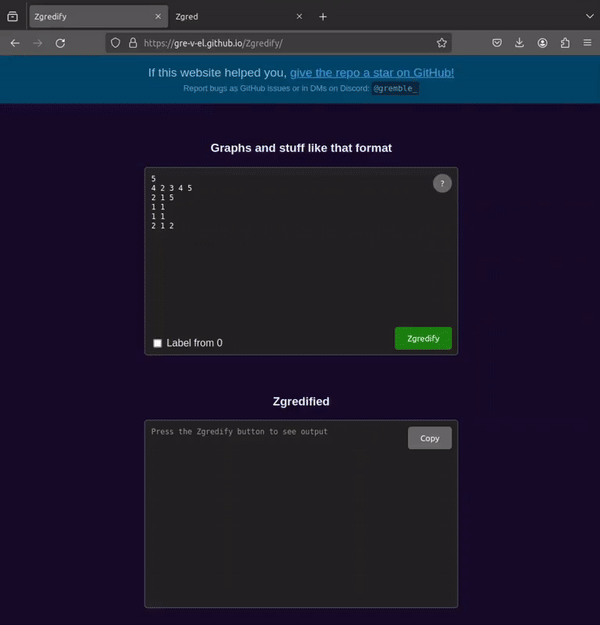

# [Zgredify - reformat graph input to be Zgred-compliant](https://gre-v-el.github.io/Zgredify/)

## Usage
* Open [gre-v-el.github.io/Zgredify](https://gre-v-el.github.io/Zgredify/)
* paste the graph data to the first text box
* click the "Zgredify" button. The Zgred-compliant graph data will be displayed in the second text box. 
* Go to [Zgred](https://stos.eti.pg.gda.pl/~kmocet/zgred/1.1.22/zgred.html)
* click `Graph > Load`, paste your Zgred-compliant graph data, and click `Load text`.
* Optionally click on the `Vartex label` dropdown and select `label` to identify vertices by their IDs

